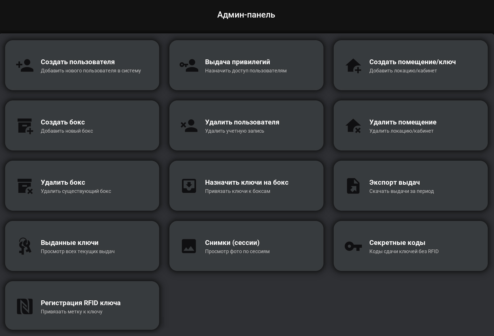

# KeyHolder — электронная ключница

Система учёта и выдачи физических ключей из интеллектуального шкафа: RFID-авторизация, права доступа, аудит, камера и управление ячейками по TCP.

> Публичная демо-версия для портфолио. Продакшен-конфиги, проприетарный контроллер шкафа и клиентские данные не включены.

**В портфолио показывает:** end-to-end продукт (UI + PostgreSQL + TCP/RFID + Docker/PyInstaller), а не учебный CRUD.  
Другие публичные кейсы: [llm-agent-gateway](https://github.com/0ver1ay/llm-agent-gateway) · [PatientMonitor-Demo](https://github.com/0ver1ay/PatientMonitor-Demo) · [профиль](https://github.com/0ver1ay)

---

## Возможности

| | |
|---|---|
| **UserApp** | Киоск у шкафа: вход по PIN / RFID, взять и сдать ключ, гостевой секретный код |
| **AdminApp** | CRUD пользователей, помещений, боксов; привилегии; привязка RFID; экспорт выдач; снимки сессий |
| **RFID** | TCP-сервер событий `USER` / `KEY` / `LOCK` + симулятор без железа |
| **Аудит** | Журнал выдач/сдач, фильтр по периоду, экспорт в файл |
| **Камера** | JPEG-снимки, привязанные к сессии выдачи |
| **Деплой** | PostgreSQL в Docker, PyInstaller (Windows / Linux Mint), systemd |

---

## Стек

- **Python 3.11+**, Kivy 2.3, KivyMD
- **PostgreSQL** + SQLAlchemy 2 + psycopg2
- **bcrypt** (пароли), OpenCV / Pillow (камера)
- TCP KEY:VALUE к контроллеру шкафа

```
UserApp / AdminApp (Kivy)
        │
        ▼
  AppController ── Auth / Camera / DeviceClient / RfidServer / SlotPoller
        │
        ▼
   PostgreSQL (users, keys, boxes, rooms, permissions, events, images)
        │
   TCP :5100 / :5200
        ▼
  Контроллер шкафа (внешний; в демо — mock / симулятор)
```

---

## Скриншоты

<p align="center">
  
</p>

| Админ | Пользователь |
|-------|----------------|
|  |  |
|  |  |

---

## Быстрый старт (демо)

### 1. PostgreSQL

```bash
cd deploy
cp .env.example .env   # задайте POSTGRES_PASSWORD
docker compose up -d
```

### 2. Конфиг приложения

```bash
cp config.cfg.example config.cfg
# password и порты должны совпадать с deploy/.env (по умолчанию 5433)
```

### 3. Зависимости и схема

```bash
python -m venv .venv
# Windows: .venv\Scripts\activate
# Linux:   source .venv/bin/activate
pip install -r requirements.txt
python scripts/create_tables.py
python scripts/seed_demo_36.py
```

Демо-логины после сида: `user1` / `user1`, `user2` / `user2` (смените в проде).

### 4. Запуск

```bash
python main_admin.py   # админ-панель
python main_user.py    # киоск пользователя
```

### 5. RFID без железа

```bash
python scripts/rfid_simulator.py
```

Протокол: [`docs/RFID_PROTOCOL.txt`](docs/RFID_PROTOCOL.txt).

---

## Структура

```
├── main_user.py / main_admin.py   # точки входа
├── controllers/                   # бизнес-логика и UI-связка
├── services/                      # auth, camera, device TCP, RFID, slot poller
├── db/                            # модели и сессия SQLAlchemy
├── views/                         # Kivy/KV экраны
├── scripts/                       # сид, симулятор RFID, схема
├── deploy/                        # Docker, systemd, сборка Linux
├── docs/                          # инструкции пользователя и админа
└── screenshots/                   # UI
```

---

## Документация

- [Инструкция пользователя](docs/ИНСТРУКЦИЯ_ПОЛЬЗОВАТЕЛЬ.md)
- [Инструкция администратора](docs/ИНСТРУКЦИЯ_АДМИН.md)
- [Установка на Linux Mint](deploy/КАК_УСТАНОВИТЬ.md)

---

## Что не входит в публичный репозиторий

- Проприетарная прошивка / SDK контроллера шкафа
- Реальные клиентские БД, фото сессий, логи доступа
- Продакшен-секреты и сетевые адреса площадок

Железо эмулируется симулятором RFID и mock-опросом слотов — архитектура приложения при этом полная.

---

## Лицензия

[MIT](LICENSE) — код демо-версии. Интеграции со сторонним оборудованием регулируются лицензиями вендоров отдельно.
